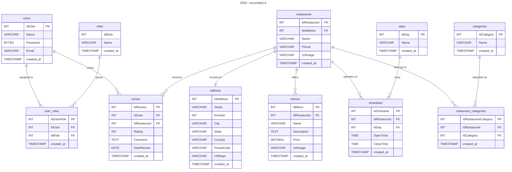

# TuComida 2.0

> oh, shit! here go again

## Project Overview

The project structure is as follows:

```bash
.
├── Dockerfile.postgres
├── ER-Diagram.md
├── README.md
├── .env
├── app
│   ├── README.md
│   ├── nest-cli.json
│   ├── package.json
│   ├── pnpm-lock.yaml
│   ├── src
│   ├── test
│   ├── tsconfig.build.json
│   └── tsconfig.json
├── db
│   ├── assets
│   ├── conf
│   ├── data
│   └── scripts
├── docker-compose.yml
└── secrets
    ├── db_password
    └── postgres-passwd
```

`app` - Contains the source code of the NestJS application.

`db` - Contains the database configuration and scripts to create the database and user. This folder is mounted as a volume in the database container.

`secrets` - Contains the passwords for the database and the postgres user.

`.env` - Contains the environment variables for the application and database.

`docker-compose.yml` - Contains the configuration to run the application and database.

`Dockerfile.psql` - Contains the configuration to build the database image.

`Dockerfile.node` - Contains the configuration to build a node image without root credentials

### Prerequisites

- [Docker](https://www.docker.com/)
- [Docker Compose v2](https://docs.docker.com/compose/)

## How usage

1 - Clone the repository:

```bash
git clone https://github.com/hharieta/tucomida2.git
```

2 - create a `.env` file in the root of the project with the following content:

```bash
DB_NAME=tucomida
DB_USER=tuuser
USER_GROUP=tugroup
DB_PORT=5432
DB_VOLUME=./db
DB_HOST=db_app

ADMINER_PORT=8080

NODE_PORT=3000
NODE_VOLUME=./app
NODE_HOST=node_app
```

Example `.env` file**

3 - Create a `secrets` folder in the root of the project and create two files `db_password` and `postgres-passwd` with the passwords for the database and the postgres user respectively.

```bash
mkdir secrets
echo "strong_password" > secrets/db_password
echo "strong_password" > secrets/postgres-passwd
```

4 - Set permissions to execute the script `init.sh`:

```bash
chmod +x db/scripts/init.sh
```

Note: This script will create a user and grant privileges to the database.

5 - Create folders for the database volumes:

```bash
mkdir db/data
mkdir db/conf
```

6 - Run the following command to start the application:

```bash
docker compose up --build -d
```

Note: Recommended to run the command to whatch the logs:

```bash
docker compose up --build
```

*Note: Future versions will include a script to automate the process of creating the `.env` file and the `secrets` folder.

## ERD - tucomida2.0


